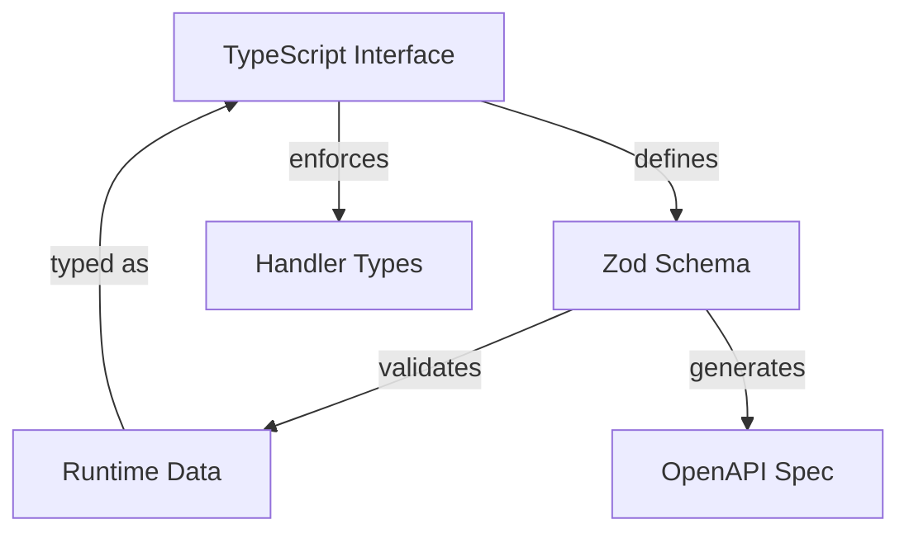

# Type-Safe Restana App with Zod Validation

[](https://www.npmjs.com/package/typed-restana-app)
[](https://www.typescriptlang.org/)
[](https://zod.dev/)
[](https://github.com/jkyberneees/restana)

A complete type-safe REST API framework built on **Restana** with **Zod** validation and automatic **OpenAPI** generation. This package provides compile-time type safety between TypeScript interfaces and validation schemas, preventing runtime errors and ensuring API consistency.

## ✨ Features

- 🛡️ **Compile-time Type Safety**: TypeScript interfaces are enforced at the schema level
- ⚡ **High Performance**: Built on Restana (fastest Node.js web framework)
- 🔍 **Zod Validation**: Modern, TypeScript-first schema validation
- 📚 **Automatic OpenAPI Generation**: Generate documentation from your schemas
- 🎯 **IntelliSense Support**: Full autocompletion and type checking in handlers
- 🔒 **Runtime Safety**: Comprehensive request/response validation
- 🎨 **Developer Experience**: Clear error messages and intuitive API

## 🚀 Quick Start

### Installation

```bash
pnpm add typed-restana-app restana zod
# or
npm install typed-restana-app restana zod
# or
yarn add typed-restana-app restana zod
```

### Basic Usage

```typescript
import restana from 'restana';
import { z } from 'zod';
import { createTypedApp } from 'typed-restana-app';

// 1. Define Zod schemas first (single source of truth)
const UserQuerySchema = z.object({
  name: z.string().optional(),
  age: z.coerce.number().int().min(0).optional()
});

const UserSchema = z.object({
  id: z.string().uuid(),
  name: z.string(),
  email: z.string().email()
});

// 2. Infer TypeScript types from schemas
type UserQuery = z.infer<typeof UserQuerySchema>;
type User = z.infer<typeof UserSchema>;

// 3. Create Restana service and typed app
const service = restana();
const app = createTypedApp(service);

// 4. Define type-safe routes
app.get<UserQuery, never, User[]>('/users', {
  schema: {
    query: UserQuerySchema,
    responses: {
      200: {
        schema: z.array(UserSchema),
        description: 'List of users'
      }
    }
  },
  metadata: {
    summary: 'Get users',
    tags: ['Users']
  },
  handler: async ({ query }) => {
    // ✅ query is fully typed as UserQuery
    // ✅ Must return User[] (enforced by TypeScript)
    return [
      {
        id: '123e4567-e89b-12d3-a456-426614174000',
        name: query.name || 'John Doe',
        email: 'john@example.com'
      }
    ];
  }
});

// 5. Start the server
service.start(3000);
```

## 📖 Complete Example

See our [comprehensive POC example](./typed-restana-app/examples/zod-poc-endpoints.ts) that demonstrates:

- ✅ Query parameter validation with coercion
- ✅ Request body validation
- ✅ Path parameter validation
- ✅ Response validation
- ✅ Error handling
- ✅ CRUD operations
- ✅ Complex validation rules with refinements

### Running the Example

```bash
# Clone the repository
git clone https://github.com/your-org/typed-restana-app
cd typed-restana-app

# Install dependencies
pnpm install

# Start the development server
pnpm run dev

# Visit http://localhost:3000
```

## 🏗️ Architecture

### Type Safety Flow



### Core Components

1. **TypedSchema**: Links TypeScript types to Zod schemas
2. **TypeSafeApp**: Type-safe wrapper around Restana
3. **Route Configuration**: Compile-time validated route definitions
4. **OpenAPI Generation**: Automatic documentation from schemas

## 📋 API Reference

### Defining Schemas and Inferring Types

The recommended approach is to define Zod schemas first and infer TypeScript types:

```typescript
// Define Zod schema (single source of truth)
const UserSchema = z.object({
  name: z.string(),
  age: z.number().int().min(0)
});

// Infer TypeScript type from schema
type User = z.infer<typeof UserSchema>;
```

### `createTypedApp(restanaService): TypeSafeApp`

Creates a type-safe wrapper around a Restana service.

```typescript
const service = restana();
const app = createTypedApp(service);
```

### Route Methods

All HTTP methods are supported with full type safety:

```typescript
// GET with query parameters
app.get<QueryType, ParamsType, ResponseType>(path, config)

// POST with request body
app.post<QueryType, ParamsType, BodyType, ResponseType>(path, config)

// PUT, PATCH, DELETE
app.put<QueryType, ParamsType, BodyType, ResponseType>(path, config)
app.patch<QueryType, ParamsType, BodyType, ResponseType>(path, config)
app.delete<QueryType, ParamsType, ResponseType>(path, config)
```

### Route Configuration

```typescript
interface RouteConfig<TQuery, TParams, TBody, TResponse> {
  schema?: {
    query?: TypedSchema<TQuery>;
    params?: TypedSchema<TParams>;
    body?: TypedSchema<TBody>;
    responses?: {
      [statusCode: number]: {
        schema: ZodSchema<any>;
        description?: string;
      };
    };
  };
  metadata?: {
    summary?: string;
    description?: string;
    tags?: string[];
    operationId?: string;
  };
  handler: (context: {
    query: TQuery;
    params: TParams;
    body: TBody;
    req: Request;
    res: Response;
  }) => Promise<TResponse> | TResponse;
}
```

## 🔧 Advanced Usage

### Custom Validation

```typescript
const CreateUserRequestSchema = z.object({
  email: z.string().email(),
  age: z.number().int().min(18).max(120),
  name: z.string().min(2).max(100)
}).refine(
  (data) => data.name !== 'admin',
  { message: "Name cannot be 'admin'" }
);

type CreateUserRequest = z.infer<typeof CreateUserRequestSchema>;
```

### Error Handling

```typescript
app.post('/users', {
  schema: { body: userSchema },
  handler: async ({ body, res }) => {
    try {
      // Business logic here
      return createdUser;
    } catch (error) {
      res.send(
        JSON.stringify({ error: 'Internal server error' }),
        500,
        { 'Content-Type': 'application/json' }
      );
      return {} as User; // Won't be sent due to early return
    }
  }
});
```

### OpenAPI Generation

```bash
# Generate OpenAPI specification
pnpm run generate-openapi

# The generated spec will be in typed-restana-app/docs/openapi.json
```

### Custom Middleware

```typescript
// Add custom middleware before creating typed app
service.use(cors());
service.use(helmet());
service.use(customAuthMiddleware);

const app = createTypedApp(service);
```

## 🎯 Benefits Over Alternatives

| Feature | This Package | Express + Joi | Fastify + Ajv | NestJS |
|---------|-------------|---------------|---------------|---------|
| **Type Safety** | ✅ Compile-time | ❌ Runtime only | ❌ Runtime only | ✅ Compile-time |
| **Performance** | ✅ Highest | ❌ Slower | ✅ Fast | ❌ Slower |
| **Schema-Type Link** | ✅ Enforced | ❌ Manual | ❌ Manual | ✅ Decorators |
| **Learning Curve** | ✅ Simple | ✅ Simple | ⚠️ Moderate | ❌ Complex |
| **Bundle Size** | ✅ Small | ✅ Small | ✅ Small | ❌ Large |
| **Modern TypeScript** | ✅ Latest | ⚠️ Basic | ⚠️ Basic | ✅ Latest |

## 📚 Examples

### CRUD Operations

See [zod-poc-endpoints.ts](./typed-restana-app/examples/zod-poc-endpoints.ts) for complete CRUD examples including:

- User listing with filtering and pagination
- User creation with validation
- User updates with partial validation
- User deletion with proper error handling

### Validation Examples

```typescript
// Query parameters with coercion
const UserQuerySchema = z.object({
  page: z.coerce.number().int().min(1).default(1),
  limit: z.coerce.number().int().min(1).max(100).default(10),
  search: z.string().min(1).optional(),
  isActive: z.coerce.boolean().optional()
});
type UserQuery = z.infer<typeof UserQuerySchema>;

// Complex validation with refinements
const CreateUserRequestSchema = z.object({
  email: z.string().email(),
  password: z.string().min(8),
  confirmPassword: z.string()
}).refine(
  (data) => data.password === data.confirmPassword,
  { message: "Passwords must match", path: ["confirmPassword"] }
);
type CreateUserRequest = z.infer<typeof CreateUserRequestSchema>;
```

## 🛠️ Development

```bash
# Install dependencies
pnpm install

# Run development server
pnpm run dev

# Build the project
pnpm run build

# Run tests
pnpm test

# Generate OpenAPI docs
pnpm run generate-openapi

# Type checking
pnpm run type-check
```

## 📝 Contributing

1. Fork the repository
2. Create your feature branch (`git checkout -b feature/amazing-feature`)
3. Commit your changes (`git commit -m 'Add amazing feature'`)
4. Push to the branch (`git push origin feature/amazing-feature`)
5. Open a Pull Request

## 📄 License

This project is licensed under the MIT License - see the [LICENSE](LICENSE) file for details.

## 🙏 Acknowledgments

- [Restana](https://github.com/jkyberneees/restana) - The fastest Node.js web framework
- [Zod](https://zod.dev/) - TypeScript-first schema validation
- [OpenAPI](https://www.openapis.org/) - API specification standard

---

**Built with ❤️ for type-safe API development**